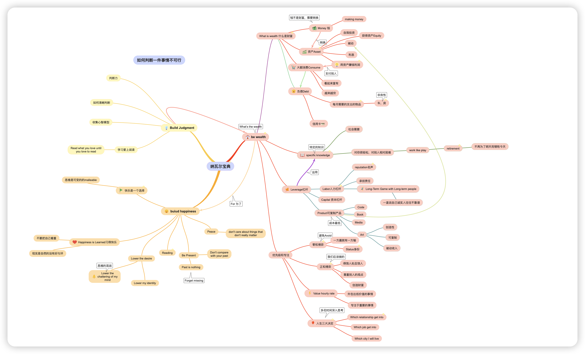
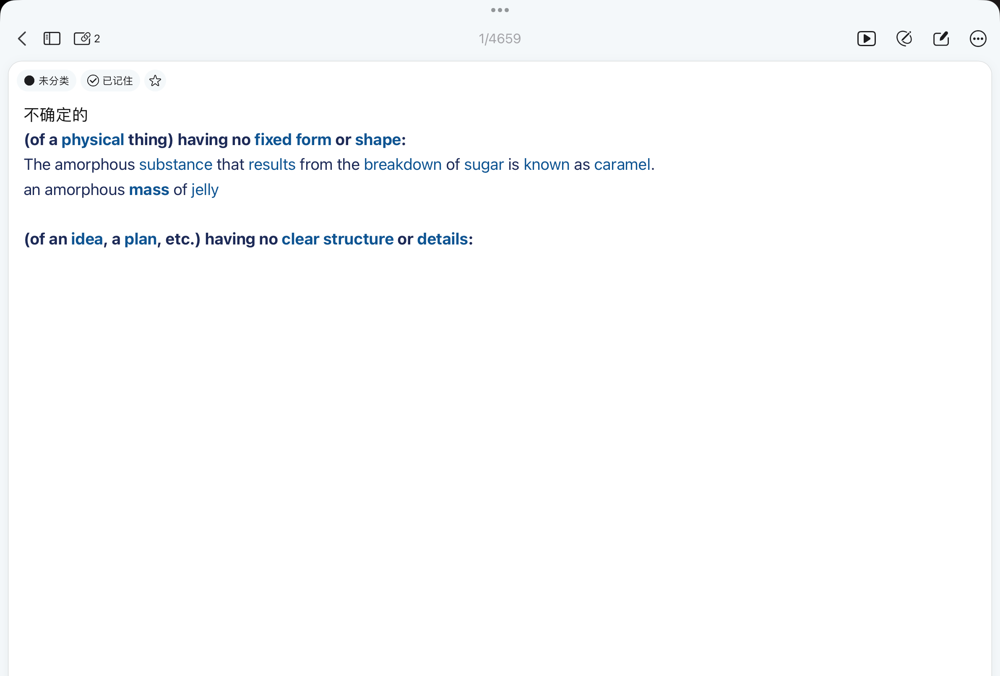
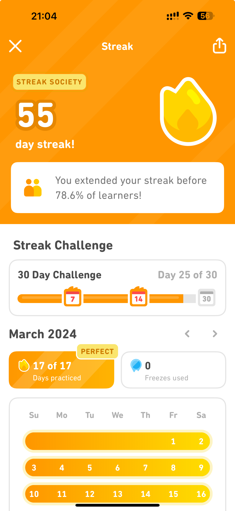

第一次写周报，主要想用这种方式来回顾自己的近期生活，记录一些自己的思考和感悟。

近两周好像节奏非常快，也感觉时间不等人，于是现在尝试用日历记录自己的重要事件，提醒自己专注。

## 输入

### 阅读

- 《纳瓦尔宝典》目前看完了财富部分也就是Build Wealth部分，感觉对于财富的概念有了新的认识，
  同时这部分也讲了如何把钱转换为财富，以及几种杠杆的知识，还有就是对Specific Knowledge,Retirement，零和博弈在生活中的应用等有了一些新理解。
  

- 《傲慢与偏见》读到了27章，这本英文原著，主要是为了练习英文阅读，也同时能看经典的小说。这里面给我感触最深的就是人和人真的是不一样的，不管是在哪个年代，大家都有自己的价值观
  和生活方式，也不应该强求别人按照自己的方式来生活,因为这本身就不现实。在小说中女主角伊丽莎白是一个思想观念非常前卫的女性，她不甘于为了家族的利益嫁给一个自己不喜欢的人，这种思想在当时是非常前卫的，
  但是她坚持了自己的想法。

### 单词

- 闪卡，主要是用来记单词，每天会不断复习之前的单词，如果有时间也会记20个新单词， 每个单词会用牛津词典去查英语解释和例句，记录到闪卡中，目前感觉效果还不错
  
  

- 多邻国，主要用来记日语单词，以及英语口语和听力非常好用，每天大概10-20分钟，后面可能会。
  

### 视频

- 《心理学导论》，目前看到了“语言”部分，感叹人之神奇，语言的产生和发展，以及语言对人的影响，还有一些心理学的实验，比如斯特鲁普效应，感觉很有意思。

### 收藏

### 文章

## 输出

### 思维导图

最近发现了一个特别好用的思维导图工具Simplemind，用来思考和整理非常好用，这期我用它整理了部分《纳瓦尔宝典》的内容。

### 代码

周末空了的时候看下机器学习相关内容，包括深度强化学习和一些数据预测的代码写着玩。
后面可能要思考一下如何将这些内容和自己的想法结合起来。

### 探索

完善了快捷指令和飞书联动记账的功能，用户提了一些小建议，虽然仅售出10份还是很开心的。
关于AI的记账思考，利用GPT来做提取信息记账，测试了一下但是成本太高，效果不好。

### 视频

B站上的视频做了一些记账的教程和日历的教程，感觉看的人不多，但是自己也是在不断的学习和进步。
[BiliBili空间](https://space.bilibili.com/518051284)
